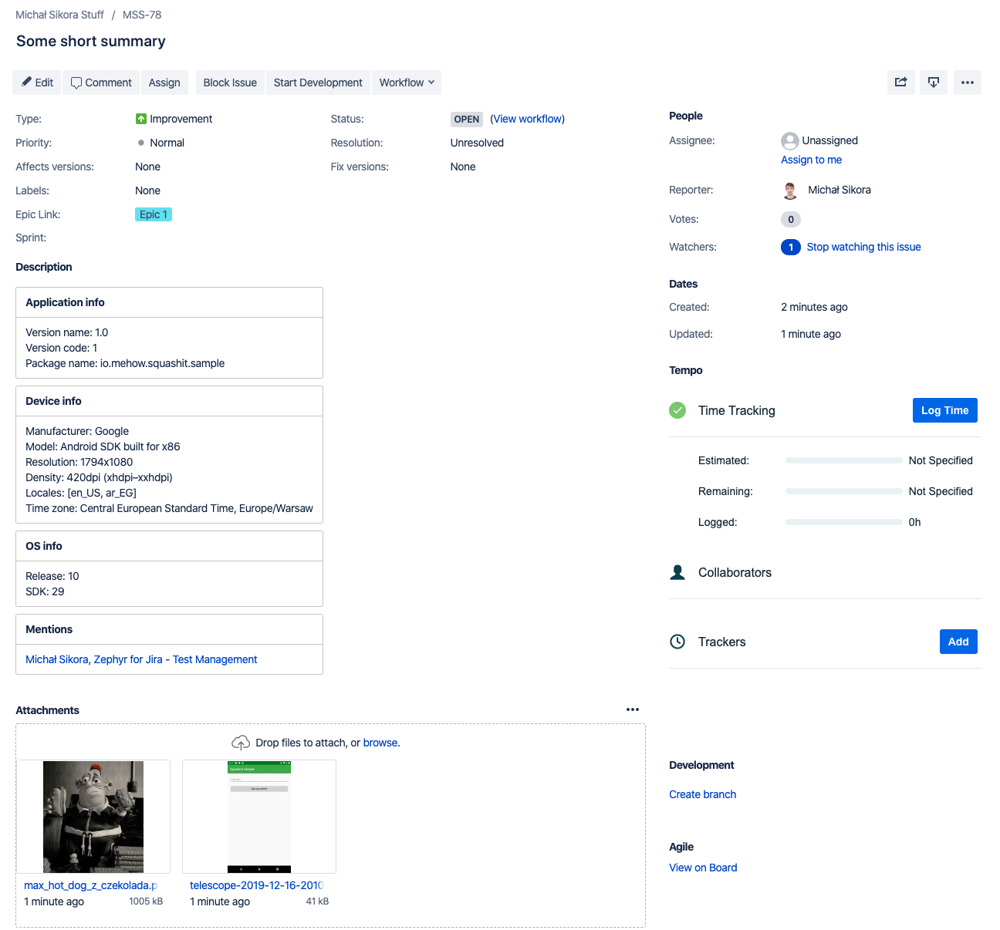
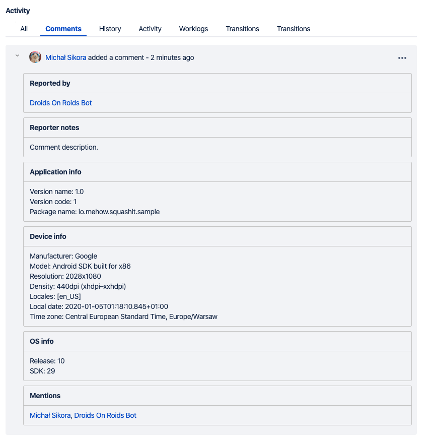

# Squash It - JIRA reporting tool

[](https://app.bitrise.io/app/d05c685963b4f009)

[](https://search.maven.org/search?q=g:io.mehow.squashit)
[](https://www.apache.org/licenses/LICENSE-2.0)

## How it works?

Squash It allows you to report JIRA issues or add comments to existing ones. You can open the tool by holding two fingers on your screen. This will capture an editable screenshot of the app's current window and let you provide the issue details.


The final report will contain all the details you provided as well as some metadata about the device.



Unfortunately, since JIRA API does not allow to set comment's author, when you add a comment to an issue it will be authored by a user who is integrated with the tool, but it will mention selected reporter.



## Integration

Squash It requires Java 8 bytecode. To enable Java 8 desugaring configure it in your Gradle script.

```groovy
android {
  compileOptions {
    sourceCompatibility JavaVersion.VERSION_1_8
    targetCompatibility JavaVersion.VERSION_1_8
  }
  // For Kotlin projects
  kotlinOptions {
    jvmTarget = "1.8"
  }
}
```

To integrate the tool with your app you need to add the dependency to your project and initialize it. Plugin should be initialized before it attaches itself to any Activity. The best place for it is the Application object. Check [the sample](sample/) for more information.

```groovy
debugImplementation "io.mehow.squashit:squashit:0.4.0"
```

```kotlin
SquashItConfigurator
    .jiraUrl("YOUR_JIRA_URL")
    .userEmail("YOUR_USER_EMAIL")
    .userToken("YOUR_USER_TOKEN")
    .projectKey("YOUR_PROJECT_KEY")
    .configure(context)
```

The user needs to have read and write permissions to your project so you should make sure that the token is not accessible outside of your organization.

## Optional configuration

Also, you can configure some optional settings that might make your life easier.

### Logs

In order to attach logs to the reports you have to delegate them to `SquashItLogger`.

```kotlin
val myLogger: MyLogger
myLogger.log { priority, tag, message -> SquashItLogger.log(priority, tag, message) }
```

If you use [Timber](https://github.com/JakeWharton/timber) you can skip this step and just depend on the Timber artifact instead.

```groovy
debugImplementation "io.mehow.squashit:timber:0.4.0"
```

By default last 2000 logs are kept in a journal. You can configure the capacity of the log file. Keep in mind, however, that logs are kept in memory prior to writing them to a file, so you should be mindful of the capacity.

```kotlin
SquashItConfigurator
    .logsCapacity(5_000)
    .configure(context)
```

### User filter

If your JIRA has a lot of tools and users assigned to them have access to your project you might want to filter them out so they don't appear in the tool.

```kotlin
val whitelistedUsers = listOf("AccountId")
SquashItConfigurator
    .userFilter { user -> user.accountId in whitelistedUsers }
    .configure(context)
```

### Issue types

The same thing applies to issue types. You might want to restrict which types of issues reporters should be allowed to create.

```kotlin
val whitelistedIssueTypes = listOf("IssueTypeId")
SquashItConfigurator
    .issueTypeFilter { issueType -> issueType.id in whitelistedIssueTypes }
    .configure(context)
```

### Finger trigger

By default, the tool is initiated by holding two fingers on a screen. However, it might not be the best idea for some applications where using two fingers is part of the app's flow (like map applications).

```kotlin
SquashItConfigurator
    .fingerTriggerCount(3)
    .configure(context)
```

### Epic deserialization

JIRA uses custom fields for epics in its model. By default, they are configured to `customfield_10009` for reading epics from a JQL query and `customfield_10008` for assigning an epic to an issue while creating it.

```kotlin
SquashItConfigurator
    .epicReadFieldName("value_a")
    .epicWriteFieldName("value_b")
```

## Sample

You can check the integration with your JIRA by running [the sample](sample/) project. You'll need however to overwrite the [configuration file](sample/src/main/java/io/mehow/squashit/sample/SampleApplication.kt).

## Attribution

* [Matthew Precious](https://github.com/mattprecious) and his awesome [Telescope library](https://github.com/mattprecious/telescope) which is used in this project.

## License

    Copyright 2019 Michał Sikora

    Licensed under the Apache License, Version 2.0 (the "License");
    you may not use this file except in compliance with the License.
    You may obtain a copy of the License at

       http://www.apache.org/licenses/LICENSE-2.0

    Unless required by applicable law or agreed to in writing, software
    distributed under the License is distributed on an "AS IS" BASIS,
    WITHOUT WARRANTIES OR CONDITIONS OF ANY KIND, either express or implied.
    See the License for the specific language governing permissions and
    limitations under the License.
